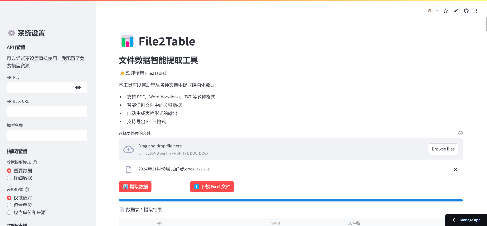

# File2Table 📊

File2Table 是一个智能文档数据提取工具，能够从各种文档中自动识别和提取结构化数据，并以表格形式呈现。



## 功能特点 ✨

- 🔍 智能识别文档中的关键数据
- 📄 支持多种文件格式（PDF、Word、TXT）
- 📊 自动生成结构化表格数据
- 📥 支持导出 Excel 格式
- 🎛️ 灵活的数据提取配置
- 💾 历史数据查看功能

## 在线体验 🌐

访问 [File2Table Demo](https://zhuhai.fun) 立即体验！

## 安装说明 🚀

1. 克隆项目：
```bash
git clone https://github.com/yourusername/file2table.git
cd file2table
```

2. 安装依赖：
```bash
pip install -r requirements.txt
```

3. 运行应用：
```bash
streamlit run app.py
```

## 环境要求 🔧

- Python 3.8+
- 依赖包：
  - streamlit
  - pandas
  - openai
  - python-docx
  - PyMuPDF
  - pywin32 (Windows系统处理.doc文件需要)

## 使用说明 📖

1. **配置设置**
   - 在侧边栏设置 API Key 和 Base URL
   - 选择模型名称
   - 配置数据提取模式和表格格式

2. **上传文件**
   - 支持的格式：PDF、DOC、DOCX、TXT
   - 文件大小限制：200MB

3. **数据提取**
   - 点击"提取数据"按钮开始处理
   - 自动显示提取进度
   - 结果以表格形式展示

4. **导出数据**
   - 支持导出为 Excel 格式
   - 包含所有提取的数据

## 提取模式 🎯

1. **数据提取模式**
   - 重要数据：仅提取关键信息
   - 详细数据：提取所有可能的数据点

2. **表格格式**
   - 仅键值对：简单的字段-数值对
   - 包含单位：添加数值单位信息
   - 包含单位和来源：完整的数据溯源信息

## 开发计划 🗓️

- [ ] 支持更多文件格式(Image/Video)
- [ ] 支持数据分析汇图
- [ ] 定制需求开发

## 技术架构 🏗️

- 前端：Streamlit
- 数据处理：Pandas
- AI模型：支持OpenAI SDK模型
- 文件处理：
  - PDF: PyMuPDF
  - Word: python-docx/pywin32
  - TXT: 原生Python

## 贡献指南 🤝

欢迎提交 Issue 和 Pull Request！

## 许可证 📄

[MIT License](LICENSE)

## 联系方式 📬

- 作者：[ZhuHai](https://zhuhai.fun)
- 友情链接：[UseAI](https://useai.cn)


